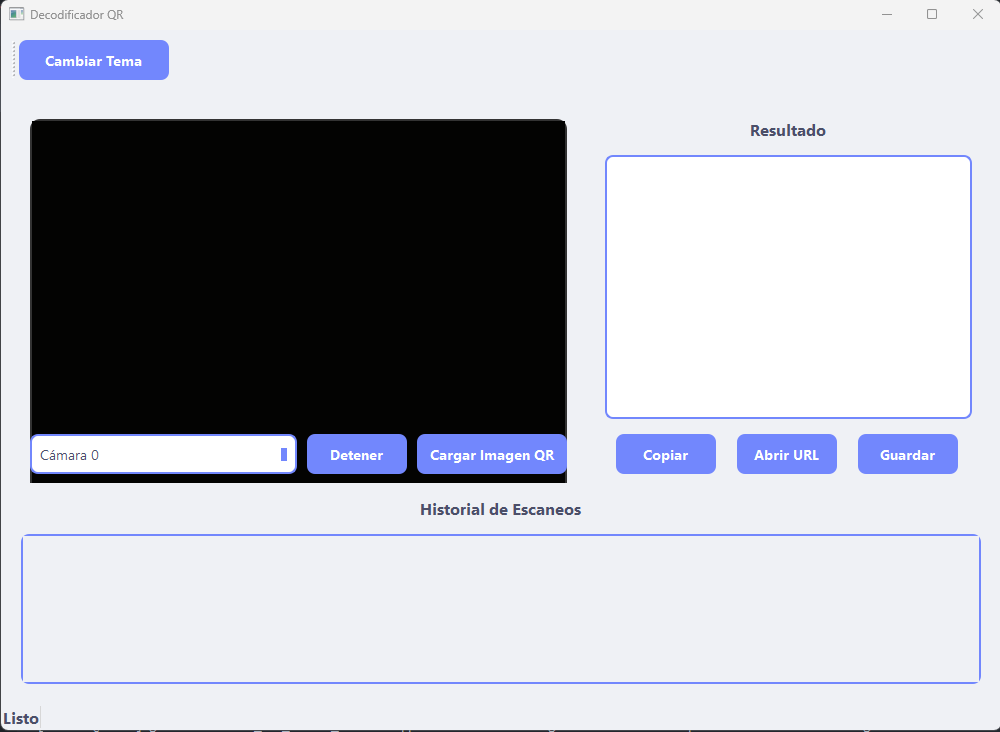
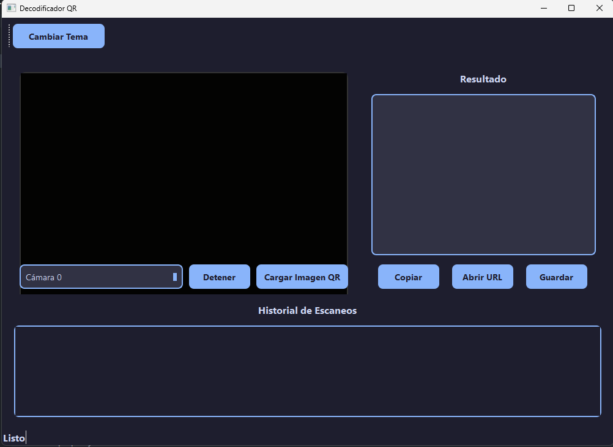

# Decodificador QR

<!-- <div align="center">
    
    
    
</div> -->

<!--  -->

## Descripcion

Una aplicación elegante y eficiente para decodificar códigos QR en tiempo real, con una interfaz moderna y funcionalidades avanzadas.

## Capturas

### Modoc claro



### Modo oscuro




## Características

- Decodificación en tiempo real mediante cámara web
- Capacidad para cargar y procesar imágenes QR
- Interfaz de usuario moderna con modo claro y oscuro
- Historial de escaneos con funcionalidades de copiado y apertura de URLs
- Opción para guardar resultados en archivo de texto
- Cambio dinámico entre múltiples cámaras
- Diseño responsivo y adaptable

## Requisitos Previos

```
Python 3.7 o superior
PyQt5
OpenCV
pyzbar
```

### Funcionalidades Principales:
- **Escaneo en Vivo**: Utiliza la cámara web para decodificar QR en tiempo real
- **Carga de Imágenes**: Permite procesar imágenes QR guardadas en el dispositivo
- **Gestión de Resultados**: Copia, abre URLs o guarda los datos decodificados
- **Cambio de Tema**: Alterna entre modo claro y oscuro para mayor comodidad

## Configuración

La aplicación guarda automáticamente las preferencias del usuario, incluyendo:
- Último tema utilizado (claro/oscuro)
- Última cámara seleccionada
